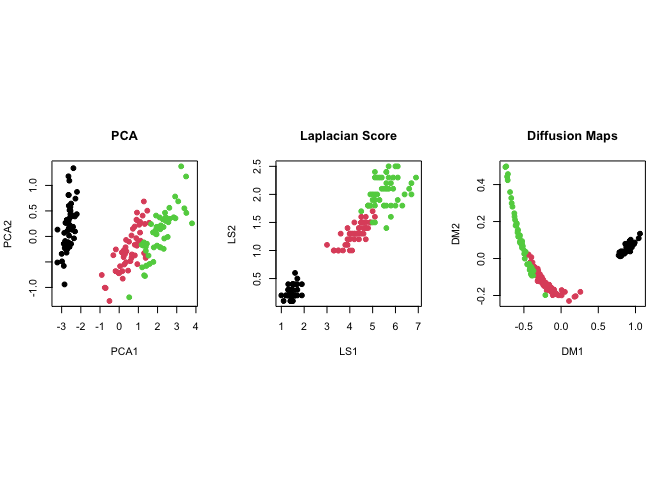

<!-- README.md is generated from README.Rmd. Please edit that file -->
Rdimtools <a href='https://kyoustat.com/Rdimtools'></a>
====================================================================================================================

<!-- badges: start -->
[](https://cran.r-project.org/package=Rdimtools) [](https://travis-ci.org/kyoustat/Rdimtools) [](https://cran.r-project.org/package=Rdimtools) <!-- badges: end -->

**Rdimtools** is an R package for dimension reduction, manifold learning, and intrnsic dimension estimation methods. We aim at building one of the most comprehensive toolbox available online. Our logo characterizes the foundational nature of dimension reduction framework; we may be blind people wrangling the data to see an [elephant](https://en.wikipedia.org/wiki/Blind_men_and_an_elephant).

The philosophy is simple, **the more we have at hands, the better we can play**.

Installation
------------

You can install a release version from CRAN:

``` r
install.packages("Rdimtools")
```

or the development version from github:

``` r
## install.packages("devtools")
devtools::install_github("kyoustat/Rdimtools")
```

Minimal Example : Dimension Reduction
-------------------------------------

Here is an example of dimension reduction on the famous `iris` dataset. Principal Component Analysis (`do.pca`), Laplacian Score (`do.lscore`), and Diffusion Maps (`do.dm`) are compared, each from a family of algorithms for linear reduction, feature extraction, and nonlinear reduction.

``` r
# load the library
library(Rdimtools)

# load the data
X   = as.matrix(iris[,1:4])
lab = as.factor(iris[,5])

# run 3 algorithms mentioned above
mypca = do.pca(X, ndim=2)
mylap = do.lscore(X, ndim=2)
mydfm = do.dm(X, ndim=2, bandwidth=10)

# visualize
par(mfrow=c(1,3))
plot(mypca$Y, pch=19, col=lab, xlab="axis 1", ylab="axis 2", main="PCA")
plot(mylap$Y, pch=19, col=lab, xlab="axis 1", ylab="axis 2", main="Laplacian Score")
plot(mydfm$Y, pch=19, col=lab, xlab="axis 1", ylab="axis 2", main="Diffusion Maps")
```


Minimal Example : Dimension Estimation
--------------------------------------


Swill Roll is a classic example of 2-dimensional manifold embedded in ℝ<sup>3</sup> and one of 11 famous model-based samples from `aux.gensamples()` function. Given the ground truth that *d* = 2, let's apply several methods for intrinsic dimension estimation.

``` r
# generate sample data
set.seed(100)
roll = aux.gensamples(dname="swiss")

# we will compare 6 methods (out of 17 methods from version 1.0.0)
vecd = rep(0,5)
vecd[1] = est.Ustat(roll)$estdim       # convergence rate of U-statistic on manifold
vecd[2] = est.correlation(roll)$estdim # correlation dimension
vecd[3] = est.made(roll)$estdim        # manifold-adaptive dimension estimation
vecd[4] = est.mle1(roll)$estdim        # MLE with Poisson process
vecd[5] = est.twonn(roll)$estdim       # minimal neighborhood information

# let's visualize
plot(1:5, vecd, type="b", ylim=c(1,3), main="true dimension is d=2",
     xaxt="n",xlab="",ylab="estimated dimension")
xtick = seq(1,5,by=1)
axis(side=1, at=xtick, labels = FALSE)
text(x=xtick,  par("usr")[3], 
     labels = c("Ustat","correlation","made","mle1","twonn"), pos=1, xpd = TRUE)
```



We can observe that all 5 methods we tested estimated the intrinsic dimension around *d* = 2. It should be noted that the estimated dimension may not be integer-valued due to characteristics of each method.

Acknowledgements
----------------

The logo icon is made by [Freepik](http://www.flaticon.com/authors/freepik) from [www.flaticon.com](http://www.flaticon.com).The rotating Swiss Roll image is taken from [Dinoj Surendran](http://people.cs.uchicago.edu/~dinoj/manifold/swissroll.html)'s website.
